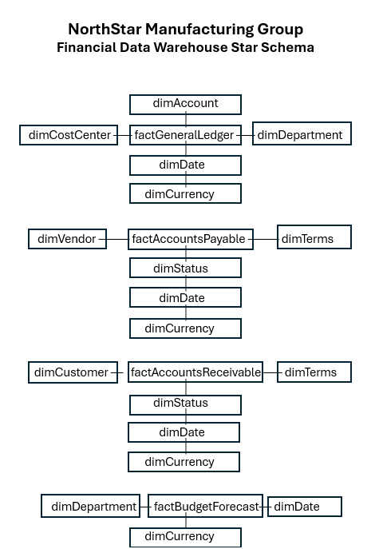

# 📊 FP&A Quarterly Business Performance Review

> **An end-to-end Financial Planning & Analysis (FP&A) project demonstrating SQL Server, dimensional modeling, DAX, and Power BI through a realistic executive reporting scenario.**


---

# 📖 Executive Summary

This project simulates a year-end **Financial Planning & Analysis (FP&A) Quarterly Business Performance Review** for **NorthStar Manufacturing Group**, a fictional manufacturing company.

Following the close of **Fiscal Year 2025 (Q4 2025)**, executive leadership requested a comprehensive financial review to evaluate business performance, measure results against budget and forecast, assess working capital, and identify strategic priorities before finalizing the **FY2026 operating plan**.

Rather than focusing only on dashboard development, this project demonstrates the complete analytics lifecycle—from raw financial data to executive decision-making.

---

# 🎯 Business Objectives

- Evaluate Actual vs Budget performance
- Identify favorable and unfavorable variances
- Analyze departmental financial performance
- Assess Accounts Payable and Accounts Receivable activity
- Evaluate working capital trends
- Support executive decision-making for FY2026 planning

---

# ❓ Executive Questions

This project answers the following business questions:

- Did the company meet its financial objectives?
- Which departments contributed most to budget and forecast variances?
- How accurately did forecasts reflect actual performance?
- Are working capital trends creating potential cash flow concerns?
- What actions should management prioritize before FY2026?

---

# 🛠 Technology Stack

| Category | Technology |
|-----------|------------|
| Database | SQL Server Express |
| SQL IDE | SQL Server Management Studio (SSMS) |
| Data Source | Microsoft Excel |
| Data Modeling | Star Schema |
| Business Intelligence | Power BI Desktop |
| Calculations | DAX |
| Documentation | Microsoft Word & PDF |
| Version Control | Git & GitHub |

---

# 📂 Repository Structure

```text
FPA-Quarterly-Business-Performance-Review
│
├── Data
├── Documentation
├── PowerBI
├── Reports
├── Screenshots
└── SQL
```

---

# 🔄 End-to-End Workflow

```text
Raw Excel Files
        │
        ▼
SQL Server Import
        │
        ▼
Data Profiling
        │
        ▼
Data Cleaning
        │
        ▼
Cleaning Validation
        │
        ▼
Dimensional Data Warehouse
        │
        ▼
Fact Table Validation
        │
        ▼
Final SQL Revisions
        │
        ▼
Power BI Semantic Model
        │
        ▼
DAX Measures
        │
        ▼
Interactive Executive Dashboard
        │
        ▼
Executive Report
```

---

# 🗄 Data Warehouse Architecture

The reporting environment is built on a **dimensional star schema** consisting of:

- **4 Fact Tables**
- **9 Dimension Tables**

The model was designed to support scalable financial reporting, time intelligence, and executive analytics.



---

# 📊 Dashboard Overview

The Power BI report is organized into five analytical pages.

## 1. Executive Overview


Provides a high-level summary of financial performance, budget variance, forecast variance, and departmental results.

---

## 2. Department Performance & Variance Analysis


Analyzes departmental performance, budget variances, and forecast comparisons.

---

## 3. Working Capital & Cash Flow Outlook


Evaluates Accounts Receivable, Accounts Payable, aging buckets, and working capital trends.

---

## 4. Financial Transaction Analysis


Examines General Ledger activity, account trends, and transaction-level insights.

---

## 5. Executive Outlook & Recommendations


Summarizes key findings, business risks, and management recommendations.

---

# 📈 Key Business Insights

- Marketing achieved the strongest favorable budget variance.
- Finance and IT recorded the largest unfavorable budget variances.
- Forecast accuracy remained above **98%** throughout FY2025.
- Working capital analysis identified a significant concentration of overdue receivables.
- General Ledger activity revealed periods of notable net transaction fluctuations.

---

# 💡 Executive Recommendations

- Improve forecasting practices for Finance and IT.
- Prioritize collection of overdue customer receivables.
- Continue monitoring departmental spending against budget.
- Review unusual General Ledger activity before FY2026 planning.
- Maintain quarterly forecast reviews to support financial planning accuracy.

---

# 💼 Skills Demonstrated

### Financial Planning & Analysis

- Budget vs Actual Analysis
- Forecast Analysis
- Variance Analysis
- Department Performance Analysis
- Working Capital Analysis
- Executive Reporting

### SQL & Data Engineering

- Data Profiling
- Data Cleaning
- Data Validation
- Dimensional Modeling
- Data Warehouse Design
- Fact & Dimension Tables
- Constraints & Indexing

### Power BI

- Data Modeling
- DAX
- Time Intelligence
- KPI Development
- Dashboard Design
- Business Storytelling

---

# 📚 Documentation

Supporting documentation included in this repository:

- 📄 Data Dictionary
- 📄 ETL Workflow
- ⭐ Star Schema
- 📑 Executive Report

---

# 🚀 How to Explore This Project

1. Read this README for an overview of the project.
2. Review the dashboard screenshots.
3. Explore the SQL workflow and data warehouse.
4. Open the supporting documentation.
5. Review the Power BI project.
6. Read the Executive Report for the final business recommendations.

---

# ⚠ Assumptions & Limitations

- NorthStar Manufacturing Group is a fictional organization created for portfolio demonstration purposes.
- The project uses historical sample data and is not connected to a live production environment.
- Recommendations are based solely on the provided datasets.
- The solution demonstrates professional FP&A and analytics practices rather than an enterprise production system.

---

# 🔮 Future Enhancements

Potential improvements include:

- Automated ETL pipelines
- Power BI Service deployment
- Row-Level Security (RLS)
- Scenario and sensitivity analysis
- Predictive forecasting using Python
- Automated data quality monitoring

---

# 👤 Author

**Diego P.**

Finance Major | Business Analytics Minor

**Career Interests**

- Financial Planning & Analysis (FP&A)
- Financial Analytics
- Business Intelligence
- SQL
- Power BI
- Data Analytics

---

> **Business problem first. Reliable data second. Analysis third. Communication always. Technology in service of all four.**

---

> **Business problem first. Reliable data second. Analysis third. Communication always. Technology in service of all four.**
