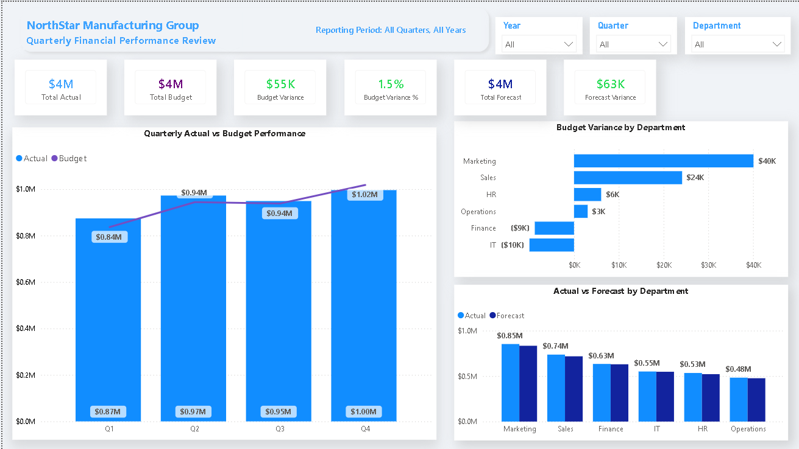
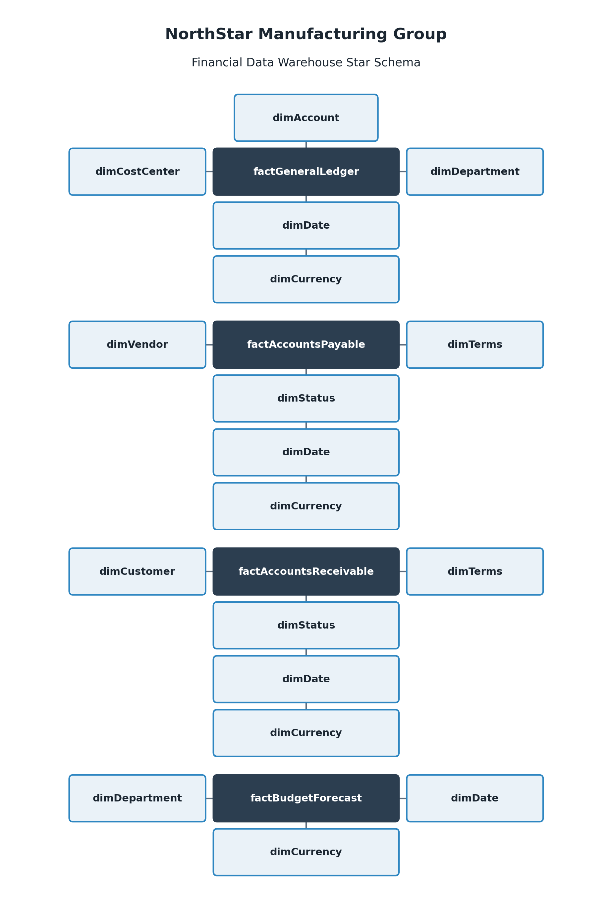
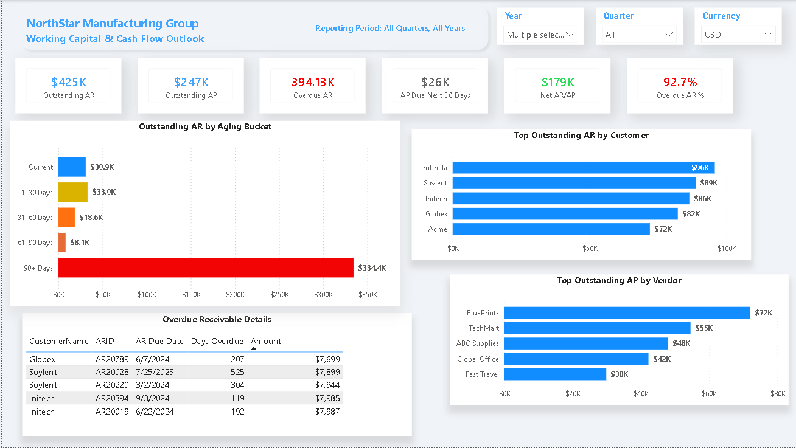
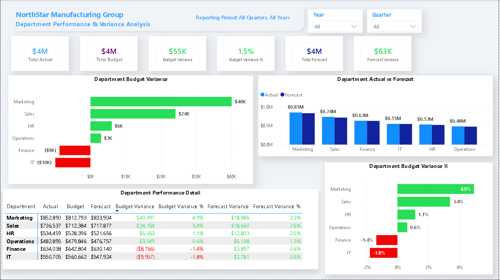
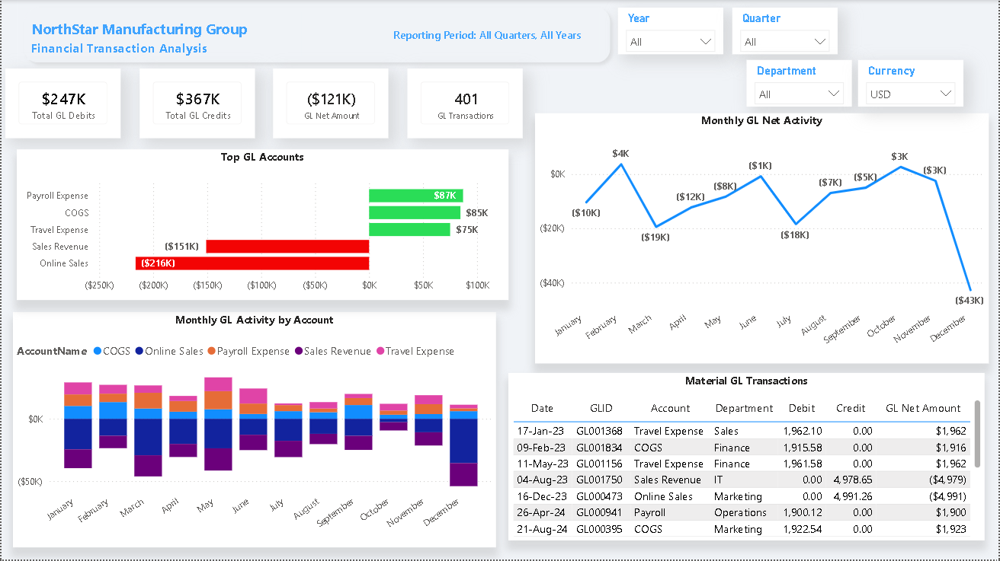
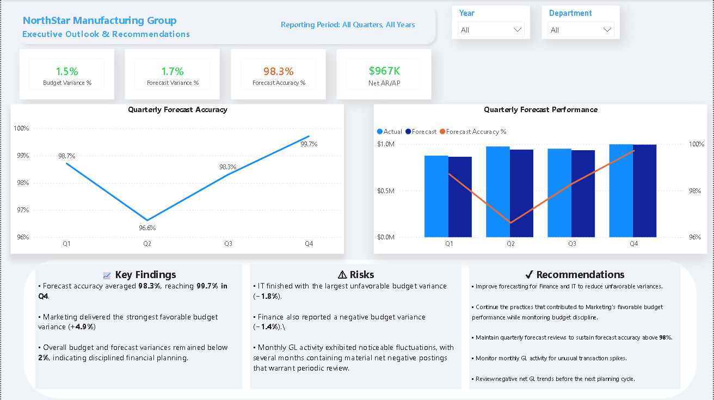
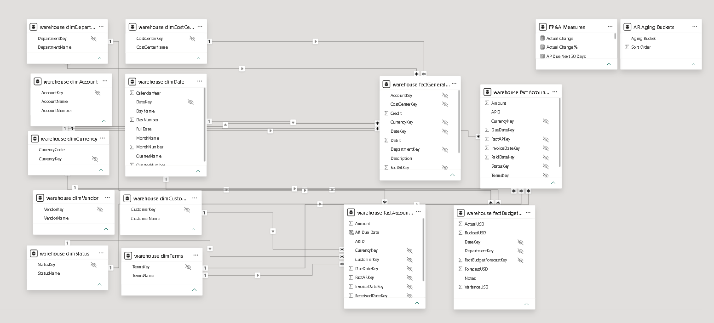

# 📊 FP&A Quarterly Business Performance Review

> **An end-to-end Financial Planning & Analysis (FP&A) project demonstrating SQL Server, dimensional modeling, DAX, and Power BI through a realistic executive reporting scenario.**



---

# 📖 Executive Summary

This project simulates an end-to-end **Financial Planning & Analysis (FP&A) Quarterly Business Performance Review** for **NorthStar Manufacturing Group**, a fictional manufacturing company.

The analysis evaluates financial performance across **FY2024–FY2025**, with a focus on actual versus budget and forecast performance, departmental variances, working capital, Accounts Receivable and Accounts Payable activity, and General Ledger trends. The Power BI report allows users to analyze results by reporting period, including individual years and quarters such as **Q4 2025**.

Rather than focusing only on dashboard development, this project demonstrates the complete analytics lifecycle—from raw financial data through SQL Server data profiling, cleaning, validation, dimensional modeling, DAX-based financial analysis, interactive Power BI reporting, and evidence-based management recommendations.

---

# 🎯 Business Objectives

- Evaluate Actual vs Budget performance.
- Identify favorable and unfavorable budget variances.
- Analyze departmental financial performance.
- Assess Accounts Payable and Accounts Receivable activity.
- Evaluate working capital trends.
- Support executive performance review and forward planning.

---

# ❓ Executive Questions

This project answers the following business questions:

- Did the company meet its financial objectives?
- Which departments contributed most to budget and forecast variances?
- How accurately did forecasts reflect actual performance?
- Are working capital trends creating potential cash flow concerns?
- What actions should management prioritize based on observed financial performance and working capital trends?

---

# 🛠 Technology Stack

| Category | Technology |
|-----------|------------|
| Database | SQL Server Express |
| SQL IDE | SQL Server Management Studio (SSMS) |
| Data Source | Microsoft Excel |
| Data Modeling | Star Schema |
| Business Intelligence | Power BI Desktop |
| Calculations | DAX |
| Documentation | Microsoft Word & PDF |
| Version Control | Git & GitHub |

---

# 📂 Repository Structure

```text
FPA-Quarterly-Business-Performance-Review
│
├── Data
├── Documentation
├── PowerBI
├── Reports
├── Images
├── SQL
├── README.md
└── LICENSE
```

---

# 🔄 End-to-End Workflow

```text
Raw Excel Files
        │
        ▼
SQL Server Import
        │
        ▼
Data Profiling
        │
        ▼
Data Cleaning
        │
        ▼
Cleaning Validation
        │
        ▼
Dimensional Data Warehouse
        │
        ▼
Fact Table Validation
        │
        ▼
Final SQL Revisions
        │
        ▼
Power BI Semantic Model
        │
        ▼
DAX Measures
        │
        ▼
Interactive Executive Dashboard
        │
        ▼
Executive Report
```

---

# 🗄 Data Warehouse Architecture

The reporting environment is built on a **dimensional star schema** consisting of:

- **4 Fact Tables**
- **9 Dimension Tables**

The warehouse was designed to support scalable financial reporting, time intelligence, and executive analytics.



---

# 📊 Dashboard Overview

The Power BI report consists of **five interactive pages**, each designed to answer a specific business question.

## 1️⃣ Executive Overview


Provides a high-level summary of actual performance, budget performance, forecast variance, quarterly trends, and departmental comparisons.

---

## 2️⃣ Working Capital & Cash Flow Outlook



Evaluates Accounts Receivable, Accounts Payable, aging buckets, overdue balances, and short-term working capital performance.

---

## 3️⃣ Department Performance & Variance Analysis



Analyzes departmental budget performance, forecast comparisons, and identifies favorable and unfavorable variances.

---

## 4️⃣ Financial Transaction Analysis



Examines General Ledger activity, account trends, transaction patterns, and operational financial activity.

---

## 5️⃣ Executive Outlook & Recommendations



Summarizes key findings, business risks, and management recommendations to support forward planning and management decision-making.

---

# 📈 Key Business Insights

- Marketing delivered the strongest favorable budget variance.
- Finance and IT recorded the largest unfavorable budget variances.
- Forecast accuracy remained above **98%** throughout FY2025.
- Working capital analysis identified a significant concentration of overdue receivables.
- General Ledger activity revealed periods of notable net transaction fluctuations.

---

# 💡 Executive Recommendations

- Improve forecasting practices for Finance and IT.
- Prioritize collection of overdue customer receivables.
- Continue monitoring departmental spending against budget.
- Review unusual General Ledger activity as part of ongoing financial monitoring and forward planning.
- Maintain quarterly forecast reviews to support planning accuracy.

---

# 🔗 Power BI Data Model

The Power BI semantic model uses one-to-many relationships between fact and dimension tables, enabling efficient filtering and interactive financial analysis.



---

# 💼 Skills Demonstrated

### Financial Planning & Analysis

- Budget vs Actual Analysis
- Forecast Analysis
- Variance Analysis
- Department Performance Analysis
- Working Capital Analysis
- Executive Reporting

### SQL & Data Engineering

- Data Profiling
- Data Cleaning
- Data Validation
- Dimensional Modeling
- Data Warehouse Design
- Fact & Dimension Tables
- Constraints & Indexing

### Power BI

- Data Modeling
- DAX
- Time Intelligence
- KPI Development
- Dashboard Design
- Business Storytelling

---

# 📚 Documentation

This repository also includes:

- 📄 Data Dictionary
- 📄 ETL Workflow
- ⭐ Star Schema Diagram
- 📑 Executive Report

---

# 🚀 How to Explore This Project

1. Read this README for the project overview.
2. Review the dashboard screenshots.
3. Explore the SQL scripts and warehouse design.
4. Review the supporting documentation.
5. Open the Power BI project.
6. Read the Executive Report for the final business recommendations.

---

# ⚠ Assumptions & Limitations

- NorthStar Manufacturing Group is a fictional organization created for portfolio demonstration purposes.
- The project uses historical sample data and is not connected to a live production environment.
- Recommendations are based solely on the provided datasets.
- The solution demonstrates professional FP&A and analytics practices rather than an enterprise production system.

---

# 🔮 Future Enhancements

Potential future improvements include:

- Automated ETL pipelines
- Power BI Service deployment
- Row-Level Security (RLS)
- Scenario and sensitivity analysis
- Predictive forecasting using Python
- Automated data quality monitoring

---

# 👤 Author

**Diego P.**

Finance Major | Business Analytics Minor

### Core Skills

- Financial Planning & Analysis (FP&A)
- Financial Analytics
- SQL
- Power BI
- Business Intelligence
- Data Analytics

---

> **Business problem first. Reliable data second. Analysis third. Communication always. Technology in service of all four.**
